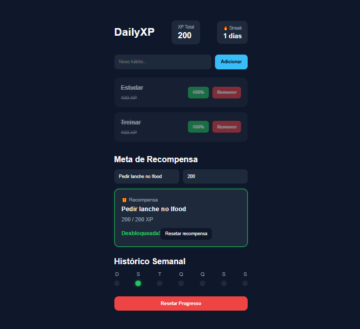

# DailyXP

Aplicação Full Stack desenvolvida para transformar mecânicas de jogos em um sistema de acompanhamento de hábitos.

Este projeto representa o mais completo do meu portfólio até o momento, reunindo Front-End, Back-End e banco de dados em uma arquitetura organizada para criar uma experiência interativa com persistência de dados e regras de negócio.

## Preview



## Demonstração

Acesse a versão online:

https://phel-lip.github.io/dailyxp/

## Sobre o Projeto

O DailyXP foi inspirado em sistemas de progressão presentes em jogos, aplicando conceitos de gamificação ao acompanhamento de hábitos.

A aplicação permite criar e gerenciar hábitos, acompanhar o progresso diário e registrar informações de forma persistente utilizando uma API desenvolvida em ASP.NET Core integrada ao PostgreSQL.

Além da construção da interface, o projeto envolveu organização da arquitetura da aplicação, comunicação entre cliente e servidor e implementação de operações CRUD.

## Funcionalidades

- Cadastro de hábitos
- Atualização de progresso
- Exclusão de hábitos
- Sistema de XP
- Sistema de sequência (Streak)
- Sistema de recompensas
- Persistência de dados em PostgreSQL
- Comunicação entre Front-End e Back-End por meio de API REST

## Tecnologias Utilizadas

### Front-End

- React
- Vite
- CSS

### Back-End

- ASP.NET Core Web API
- Entity Framework Core

### Banco de Dados

- PostgreSQL

## Estrutura do Projeto

```text
dailyxp/

├── frontend/ → Interface da aplicação em React
├── backend/
│   ├── Controllers/ → Endpoints da API
│   ├── Models/ → Modelos de dados
│   ├── Data/ → Contexto do banco de dados
│   ├── Migrations/ → Controle de versões do banco
│   └── Program.cs → Configuração da aplicação
```

## Como Executar Localmente

### Clone o repositório

```bash
git clone https://github.com/Phel-lip/dailyxp.git
```

### Front-End

```bash
cd frontend

npm install

npm run dev
```

### Back-End

```bash
cd backend

dotnet restore

dotnet ef database update

dotnet run
```

É necessário possuir uma instância do PostgreSQL configurada e ajustar a connection string no arquivo `appsettings.json`.

## Objetivo

Este projeto consolida minha evolução ao longo do portfólio, reunindo conceitos de desenvolvimento Front-End moderno com integração entre API, banco de dados e regras de negócio.

Além da implementação da interface, a aplicação demonstra organização em camadas, comunicação cliente-servidor e persistência de dados utilizando tecnologias amplamente adotadas no desenvolvimento web.

## Autor

Thasso Holanda

GitHub:
https://github.com/Phel-lip
